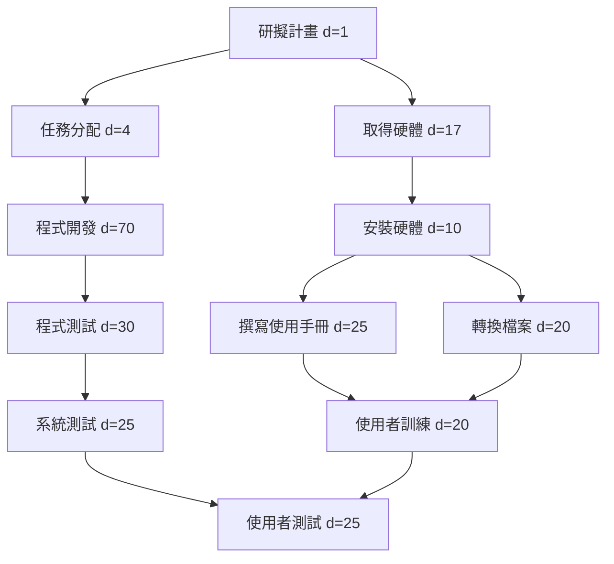

# 專案排程 (PERT/CPM, 甘特圖, 關鍵路徑)

> 資料來源：題目圖表（11項任務）。專案起算日以「第 1 天」為 Day 1（內部計算使用 0-based，輸出與表格以 Day 1 起算）。

---

## 一、任務清單與任務型態（任務編號 / 說明 / 需時(天) / 前置任務）
| 編號 | 任務名稱 | 需時 (天) | 前置任務 |
|---:|---|---:|---|
| 1 | 研擬計畫 | 1 | - |
| 2 | 任務分配 | 4 | 1 |
| 3 | 取得硬體 | 17 | 1 |
| 4 | 程式開發 | 70 | 2 |
| 5 | 安裝硬體 | 10 | 3 |
| 6 | 程式測試 | 30 | 4 |
| 7 | 撰寫使用手冊 | 25 | 5 |
| 8 | 轉換檔案 | 20 | 5 |
| 9 | 系統測試 | 25 | 6 |
| 10 | 使用者訓練 | 20 | 7, 8 |
| 11 | 使用者測試 | 25 | 9, 10 |

---

## 二、時間表（計算結果） — 使用 CPM（關鍵路徑法）
> 備註：表中「開始日/結束日」以 Day 1 為起算（例如 Day 1 = 專案第 1 天）。ES/EF 為最早開始/最早完成（0-based 內部計算），LS/LF 為最晚開始/最晚完成，Slack = LS - ES。

| 編號 | 任務 | 需時 | 最早開始 ES (0-based) | 最早完成 EF (0-based) | 開始日 (Day) | 結束日 (Day) | 最晚開始 LS | 最晚完成 LF | Slack | 是否關鍵任務 |
|---:|---|---:|---:|---:|---:|---:|---:|---:|---:|---:|
| 1 | 研擬計畫 | 1 | 0 | 1 | 1 | 1 | 0 | 1 | 0 | 是 |
| 2 | 任務分配 | 4 | 1 | 5 | 2 | 5 | 1 | 5 | 0 | 是 |
| 3 | 取得硬體 | 17 | 1 | 18 | 2 | 18 | 58 | 75 | 57 |  |
| 4 | 程式開發 | 70 | 5 | 75 | 6 | 75 | 5 | 75 | 0 | 是 |
| 5 | 安裝硬體 | 10 | 18 | 28 | 19 | 28 | 75 | 85 | 57 |  |
| 6 | 程式測試 | 30 | 75 | 105 | 76 | 105 | 75 | 105 | 0 | 是 |
| 7 | 撰寫使用手冊 | 25 | 28 | 53 | 29 | 53 | 85 | 110 | 57 |  |
| 8 | 轉換檔案 | 20 | 28 | 48 | 29 | 48 | 90 | 110 | 62 |  |
| 9 | 系統測試 | 25 | 105 | 130 | 106 | 130 | 105 | 130 | 0 | 是 |
| 10 | 使用者訓練 | 20 | 53 | 73 | 54 | 73 | 110 | 130 | 57 |  |
| 11 | 使用者測試 | 25 | 130 | 155 | 131 | 155 | 130 | 155 | 0 | 是 |

專案總工期（最早完工時間） = **155 天**（從 Day 1 起算）

---

## 三、關鍵路徑（Critical Path）
關鍵路徑上的任務（Slack = 0）：
**1 → 2 → 4 → 6 → 9 → 11**

說明：任何關鍵路徑上任務的延遲都會直接延長專案完工時間。專案工期為 155 天。

---

## 四、PERT/CPM 網路圖


---

## 五、甘特圖（文字化視覺化，橫軸為天數；Bar 長度按專案總工期比例縮放至 50 格）
```
Legend: [=====] 長條表示任務持續期間（比例化）

Project duration = 155 days (Day 1 ~ Day 155)

1.研擬計畫                 1 - 1   [=]
2.任務分配                 2 - 5   [=]
3.取得硬體                 2 - 18  [=====]
4.程式開發                 6 - 75   [======================]
5.安裝硬體                19 - 28       [===]
6.程式測試                76 - 105                         [=========]
7.撰寫使用手冊              29 - 53           [========]
8.轉換檔案                29 - 48           [======]
9.系統測試               106 - 130                                  [========]
10.使用者訓練              54 - 73                   [======]
11.使用者測試             131 - 155                                          [========]

（註）此甘特圖為文字化示意，橫軸比例化以便於 Markdown 顯示；如需精確日曆甘特圖，請告訴我專案起始日期（例如 2025-09-01），我會回傳含實際日期的甘特圖（Mermaid 或 CSV）。

---

## 六、輸出步驟總結（你要求的兩個步驟）
1. 顯示任務及任務模式：已於「一、任務清單與任務型態」與表格顯示。  
2. 輸入開始及結束時間：已於「二、時間表」中以 Day 起算顯示每個任務的開始日與結束日；並在 ASCII 甘特圖中以比例條顯示視覺化。

---

如果你要我把這個 Markdown 轉成其他格式（如 PDF、PPT、或加入實際起始日自動計算日期），或要高品質的甘特圖 PNG，我可以直接產生。請告訴我你要的檔案格式（我已將本檔存成 `schedule.md`，見下方下載連結）。 
